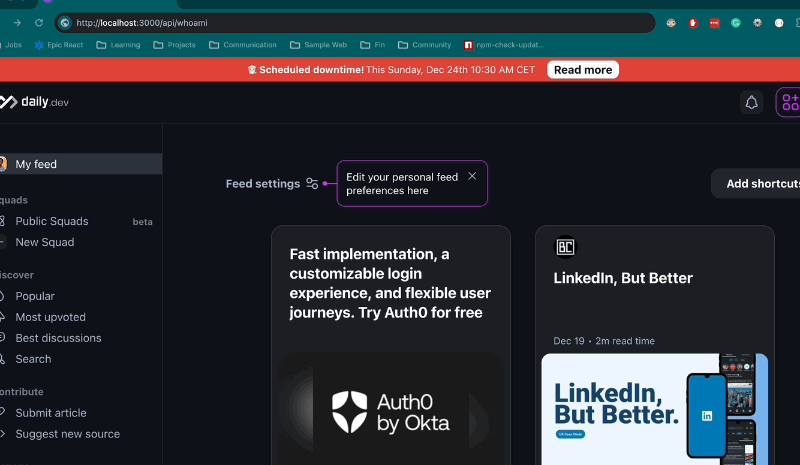

# Request Header Parser

freeCodeCamp - Back End Development and APIs | Project: Request Header Parser

# Summary

Create a Request Header Parser api that when you make a request to `/api/whoami` it should return a JSON object with:

-   IP address in the `ipaddress` key.
-   Preferred language in the `language` key.
-   Software in the `software` key.
    **[Learn more about the Project Task.]([https://www.freecodecamp.org/learn/back-end-development-and-apis/back-end-development-and-apis-projects/timestamp-microservice](https://www.freecodecamp.org/learn/back-end-development-and-apis/back-end-development-and-apis-projects/request-header-parser-microservice)**

### Implementation

-   Created a TypeScript + Express API
-   Create a route called `/api/whoami` that retrieves the following:
-   From the `req` object, we can get the **ip address**. The IP Address is a unique address that identifies a device on the internet or a local network.
-   From the `headers` object, we can get:
-   the **accept-language** header is used by a client (typically a web browser) to communicate to the server the preferred languages for content. The server can then use this information to provide content in the most suitable language for the user.
-   the **user-agent header** is a standard HTTP header included in the request sent by a user agent, typically a web browser or a similar client, to provide information about the user agent (i.e., the software and device) making the request.

#### Code implementation

```
  const { ip, headers } = req;

	const ipaddress = ip;
	const language = headers['accept-language'];
	const software = headers['user-agent'];
	const responseObject = {
		ipaddress,
		language,
		software
	};
```

### Demo



# Technologies:

-   JavaScript
-   TypeScript
-   Render
